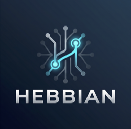

<p align="center">
  
</p>

# hebbian-mcp

Customer-installable adapter for the Hebbian tenant brain. Connect Claude Code, Claude Desktop, Cursor, and any MCP-compatible agent to your Hebbian workspace.

The adapter is a thin bearer-auth shim. Your token goes in; the Hebbian API enforces what you can read and write. All the logic — typed graph, ranking, fidelity scoring, synthesis — lives server-side. This package is intentionally auditable before you paste a credential.

## Packages

| Package | Language | Install |
|---|---|---|
| `@hebbian/mcp-tenant` | TypeScript / Node.js | `npm install -g @hebbian/mcp-tenant` |
| `hebbian-mcp-tenant` | Python | `pip install hebbian-mcp-tenant` |

Both expose the same 8 tools, the same auth flow, and the same token types. Use whichever matches your MCP host.

## Quick start (TypeScript)

```bash
npm install -g @hebbian/mcp-tenant
```

Generate a token from your Hebbian integrations page (AI Tools tab → Generate token).

### Claude Code

```bash
claude mcp add hebbian \
  -e HEBBIAN_API_TOKEN=hbn_emp_your_token_here \
  -- npx -y @hebbian/mcp-tenant
```

### Claude Desktop

Add to `~/Library/Application Support/Claude/claude_desktop_config.json`:

```json
{
  "mcpServers": {
    "hebbian": {
      "command": "npx",
      "args": ["-y", "@hebbian/mcp-tenant"],
      "env": {
        "HEBBIAN_API_TOKEN": "hbn_emp_your_token_here"
      }
    }
  }
}
```

### Cursor

Add to `.cursor/mcp.json`:

```json
{
  "mcpServers": {
    "hebbian": {
      "command": "npx",
      "args": ["-y", "@hebbian/mcp-tenant"],
      "env": {
        "HEBBIAN_API_TOKEN": "hbn_emp_your_token_here"
      }
    }
  }
}
```

## Quick start (Python)

```bash
pip install hebbian-mcp-tenant
# or with uv (preferred)
uv add hebbian-mcp-tenant
```

```bash
HEBBIAN_API_TOKEN=hbn_emp_your_token_here hebbian-mcp
```

## Token types

| Token prefix | Scope | Issued from |
|---|---|---|
| `hbn_emp_` | Employee — your personal brain | `/integrations?tab=tools` |
| `hbn_co_` | Company — full org brain (admin only) | `/co/integrations?tab=tools` |

Tokens expire after 90 days. Refresh from the AI Tools tab. Never commit tokens to git.

## Tools

| Tool | Description |
|---|---|
| `hebbian_read_node` | Fetch a single node by UUID (body, frontmatter, provenance) |
| `hebbian_search` | Full-text + semantic search across vault nodes |
| `hebbian_ask` | Synthesis Q&A grounded in source_quotes (RAG) |
| `hebbian_capture` | Capture text as a new seed into the vault |
| `hebbian_traverse` | Walk the typed graph from a starting node |
| `hebbian_provenance` | Source trail for a node |
| `hebbian_salience` | Salience snapshot (no-op until SNN Phase 10) |
| `hebbian_recent_activity` | Recent brain activity timeline |

## Configuration

### Environment variable

```bash
export HEBBIAN_API_TOKEN=hbn_emp_your_token_here
```

### Config file (alternative)

Write `~/.config/hebbian/mcp-tenant.json`:

```json
{
  "token": "hbn_emp_your_token_here",
  "api_url": "https://api.<saas-apex>"
}
```

Enterprise self-host customers set `HEBBIAN_API_URL` to their VM's API endpoint.

> Note: `api.<saas-apex>` is a placeholder — the Hebbian SaaS domain is not yet published. Enterprise customers configure their own endpoint via `HEBBIAN_API_URL`.

## Onboarding

Sign in at the Hebbian app (link TBD — domain parked), navigate to AI Tools, and generate a tenant token. Paste it into your MCP client config as shown above.

## Security

- Tokens are bearer credentials — treat like passwords.
- Never commit tokens to git. Use env vars or a config file outside your repo.
- Tokens expire after 90 days. A `401 TOKEN_EXPIRED` response means the token needs refreshing.
- HTTPS-only transport. HTTP is rejected at the API edge.
- The adapter source is intentionally public so you can audit what runs on your machine before pasting a credential. The API enforces all access control server-side (row-level security by tenant + actor).

## Source layout

```
ts/    — TypeScript package (@hebbian/mcp-tenant, npm)
py/    — Python package (hebbian-mcp-tenant, PyPI)
```

## Development

### TypeScript

```bash
cd ts/
npm install
npm run build
npm test
```

### Python

```bash
cd py/
uv install --dev
pytest
ruff check src/ tests/
```

## Contributing

See [CONTRIBUTING.md](CONTRIBUTING.md).

## License

Apache-2.0. See [LICENSE](LICENSE).

The Hebbian API that this adapter connects to is proprietary and closed-source (ADR-017). This adapter package is the open-source reference client.
